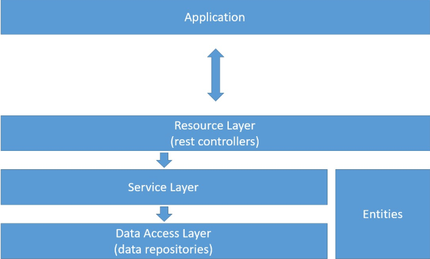
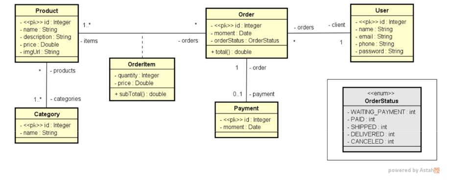
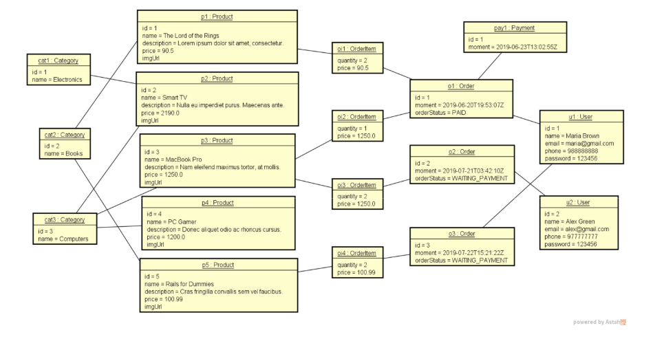

# Project: Web Services com Spring Boot e JPA / Hibernate 

## Sumário
- [Domain Model](#Domain-Model)
- [Domain Instance](#Domain-Instance)
- [User entity and resource](#User-entity-and-resource)
- [H2 database, test profile, JPA](#H2-database-test-profile-JPA)
- [JPA repository, dependency injection, database seeding](#JPA-repository-dependency-injection-database-seeding)
- [Service layer, component registration](#Service-layer-component-registration)
- [Order, Instant, ISO 8601](#order-instant-iso-8601)
- [OrderStatus enum](#orderstatus-enum-)
- [Entidade Category](#entidade-category)


## Service Layer


A camada de **Resources** é um **controlador**. Deve somente **intermediar** as operações de aplicação e regras de negócio.

Portanto, o Resources (controlador/UserResource) irá **depender do Service (service/UserService).**

E o Service depende do Repository/UserRepository - <b>a interface</b>.

Ou seja: @RestControllers (UserResource) tem dependencia de @Services (UserService) e por sua vez, Services dependem de @Repository.

### MAIS

Sabemos que o UserService importado para dentro do UserResource com @AutoWired foi injetada automaticamente pelo Spring.

Mas para a variável service (advinda do UserService) funcionar dentro da classe (UserResource), a classe UserService deve ser registrada como um componente do Spring.

```java
@Component
public class UserService {}

    E assim, essa classe poderá ser injetada automaticamente com o @AutoWired na outra classe:

public class UserResource {
    @Autowired
    private UserService service;
```
<hr>

<details>
    <summary style="font-size: 25px">
        Diferença entre Service, Resource e Repository
    </summary>

#### - @Services
Importa para si o Repository.

O service é responsável pela lógica da aplicação.
Ele encapsula as operações que são específicas da aplicação, como validações, cálculos complexos, interações entre entidades de domínio, e outras regras de negócio.

É comum que os Services sejam injetados em outros componentes, como Controllers (no caso do Spring MVC) ou outros Services, para que a lógica de negócio seja executada de forma organizada e isolada. Exemplo:
```java
@Service
public class ProductService {
    @Autowired
    private ProductRepository productRepository;

    public List<Product> getAllProducts() {
        return productRepository.findAll();
    }

    // Métodos para salvar, atualizar, deletar produtos, etc.
}
```

#### - @Resource
Importa para si o UserService.

Resource representa um ponto de extremidade (endpoint) na sua aplicação RESTful. Ou seja, é um controlador que lida com requisições HTTP e retorna respostas, geralmente em JSON ou XML.

Um resource pode ser um controlador Spring MVC anotado com @RestController, que combina a funcionalidade de @Controller e @ResponseBody. Exemplo:
```java
@RestController
@RequestMapping("/api/products")
public class ProductResource {
    @Autowired
    private ProductService productService;

    @GetMapping
    public List<Product> getAllProducts() {
        return productService.getAllProducts();
    }

    // Outros métodos para lidar com POST, PUT, DELETE, etc.
}
```
#### - @Repository
O repository é uma camada de abstração que lida com o acesso a dados. Ele encapsula a lógica de acesso a banco de dados ou outra fonte. Em geral, Repository é usado para recuperar dados,
salvar, atualizar e deletar registros no banco de dados.

Repositories são frequentemente implementados usando o padrão de deisgn Repository e não anotados com @Repository. Exemplo:
```java
@Repository
public interface ProductRepository extends JpaRepository<Product, Long> {
    // Métodos para acessar dados relacionados a produtos
}
```
</details>
<hr>

<details>
    <summary style="font-weight: bold; font-size: 25px">Anotações Spring @</summary>

## Anotações Spring @

- ### @Entity
Informa que uma classe também é uma entidade. Estabelecerá a ligação entre a entidade nomeada e uma tabela de mesmo nome no banco de dados.

Uma entidade é uma tabela no banco de dados. 

Além disso, cada tabela possui um nome. Então precisamos usar a anotação @Table.


- ### @Table

Aqui podemos especificar detalhes da tabela que serão utilizados para persistir as nossas entidades no banco de dados.

Se não usarmos essa anotação, não teremos erro. A menos que já exista uma tabela com esse nome no banco de dados.


- ### @GeneratedValue 
É uma enum. Usamos para informar que geração do valor do identificador único será gerenciada pelo proprio provedor de persistência.

  Usamos logo após @Id. Se não passarmos essa anotação, significa que a responsabilidade de gerar e gerir as chaves primárias, será da aplicação.
  - **GenerationType.AUTO** - Padrão. Deixa o provedor de persistência a escolha da estratégia mais adequada.
  - **GenerationType.IDENTITY** - Será um autoincrement. Os valores serão gerados para cada registro inserido no banco.
  - **GenerationType.SEQUENCE** - Será ingerido a partir de uma sequência. Caso não seja especificado um nome para a sequence, será utilizada uma sequence padrão, a qual será global, para todas as entidades.
  - **GenerationType.TABLE** - É necessário criar uma tabela para gerenciar as chaves primárias. Essa opção é pouco recomendada.
  

- ### @Configuration  

Para o Spring identificar que é uma classe de configuração.

  - Essa classe de configuração ela não é nem controller, service ou repository. Ela é uma classe auxiliar que vai fazer umas configurações na aplicação. 
  - Criamos um package chamado config e criamos uma entidade chamada TestConfig. 
  - **Para o Spring identificar que é uma classe de configuração, passaremos uma anottation @Configuration.**
   
Além disso, para caracterizarmos essa classe como perfil de teste, passaremos uma anottation @Profile("test").

**Essa classe TestConfig vai servir para database seeding. Ou seja, popular o banco de dados. Sabemos que para acessar/salvar coisas no banco de dados utilizamos o Repository.**
```java
@Configuration
@Profile("test")
public class TestConfig {}
```

- ### @AutoWired 

Ela associa uma instância numa classe. No nosso exemplo, nós importamos para a classe **TesteConfig** o **UserRepository** e usamos essa anotação. 
```java
@Configuration
@Profile("test")
public class TestConfig implements CommandLineRunner {
    @Autowired
    private UserRepository userRepository;
```

- ### @Component
É um esteriótipo, suas especializações são:
- @Repository
  - Pacote repositories.
- @Service
  - pacote services.
- Controller/RestController
  - pacote resources


Quando uma classe é anotada com @Component significa que a mesma usará o padrão de injeção de depêndencia, e será elegível para auto-configuração e auto-detecção de objeto instanciado anotados à partir de escaneamento de classpath que o IoC Container do Spring faz.

A anotação **@Component** deve ser usada em nível de classe, dessa forma:
```java
@Component
public class Foo {
//implementação da  classe
}
```
Para referenciar a mesma em outro contexto (obter a instância), pode se usar a anotação @Autowired, dessa forma:
```java
@Component
public class Bar {
   @Autowired
   private Foo foo;
}
```


- ### @Controller 

Para que os dados sejam serializados diretamente na response. Usamos @ResponseBody nos métodos. Para não ficarmos reescrevendo toda hora, utilizamos @RestController.

É util para aplicações mais tradicionais, porque você pode rendarizar templates ou serialização diretas de dados (@ResponseBody).

Agora, se a aplicação é toda API Restful, sem templates HTML, utilize @RestController.

- ### @RestController 
Elimina a necessidade de ficar reescrevendo e anotando os métodos com @ResponseBody. Já que todos os dados serão serializados em JSON/XML e jogados na response.
  
**O RestController é inserido em classes que possuem ResourceLayer. Se temos uma classe Usuario, por exemplo, teremos uma UserResource onde ele será inserido, conforme abaixo.**
```java
@RestController
@RequestMapping(value = "/users")
public class UserResource {}
```

- ### @RequestMapping 
Geralmente usamos nas classes Controllers, pois dessa forma, todos os métodos herdam o endereço do controller, evitando repetições.

### Exemplos:
#### Estrutura com repetição:
```java
@RequestMapping
public class HelloController {

    @GetMapping("/hello")
    public String olaMundo() {
        return "Hello World!";
    }
    
    @GetMapping("/hello/bye")
    public String olaMundo() {
        return "Bye World!";
    }
    
}
```

#### Estrutura sem repetição:
```java
@RequestMapping("/hello")
public class HelloController {

    @GetMapping
    public String olaMundo() {
        return "Hello World!";
    }
    
    @GetMapping("/bye")
    public String olaMundo() {
        return "Bye World!";
    }
}
```

- ## @ManyToOne e @OneToMany 
Utilizado para fazer relacionamento entre classes. Exemplo: Temos uma classe de Order e Usuários. Naturalmente, teremos várias ordens para um usuário. E um usuário para várias ordens.
  - @ManyToOne - Como são várias ordens para um usuário, usamos a anotação abaixo na linha onde o usuário foi importado.
    ```java
        @ManyToOne
        @JoinColumn(name = "client_id")
        private User client;
    ```
  - @OneToMany - Um usuário pra várias ordens. O mappedBy diz: com qual nome a classe User foi importada para a outra.
  ```java
    @OneToMany(mappedBy = "client")
    private List<Order> orders = new ArrayList<>();
```

- ## @JsonIgnore


Se temos uma associação de mão dupla (muitos para um). O Jackson (biblioteca de serialização) fica chamando.

O pedido chama usuário, usuário chama pedido... e assim fica um looping.

Portanto, tem que colocar o JsonIgnore em algum dos dois lados.


</details>
<hr>


## Conteúdo - Início das Aulas
- Criar projeto Spring Boot Java
- Implementar modelo de domínio
- Estruturar camadas lógicas: resource, service, repository
- Configurar banco de dados de teste (H2)
- Povoar o banco de dados
- CRUD - Create, Retrieve, Update, Delete
- Tratamento de exceções

## Domain Model


## Domain Instance



## UserResource
```java
@RestController
@RequestMapping(value = "/users")
public class UserResource {
    @GetMapping
    public ResponseEntity<User> findAll() {
        User u = new User(1L, "Maria", "maria@gmail.com", "99999", "12345");
        return ResponseEntity.ok().body(u);
    }
}
```
- @RequestMapping - Utilizamos ela nas classes Controllers, porque assim todos os métodos herdam o endereço do controller. Se usássemos @GetMapping, teríamos que repetir a anotação em todo método da classe. <br>
  Por exemplo, acima passamos o Mapping com o valor "/users". Portanto, todo método por padrão, irá herder esse endereço.


- @GetMapping - Feito para requisições GET, conforme utilizado no método acima.
<hr>

## H2 database, test profile, JPA

### Checklist:
- JPA & H2 dependencies
- application.properties
- application-test.properties
- Entity: JPA mapping 

<details>
  <summary style="font-weight: bold; font-size: 18px">Dependencies:</summary>

```xml
  <dependency>
    <groupId>org.springframework.boot</groupId>
    <artifactId>spring-boot-starter-data-jpa</artifactId>
  </dependency>

  <dependency>
    <groupId>com.h2database</groupId>
    <artifactId>h2</artifactId>
    <scope>runtime</scope>
  </dependency>
```
</details>


<details>
  <summary style="font-weight: bold; font-size: 18px" >application.properties:</summary>

```
spring.profiles.active=test
spring.jpa.open-in-view=true
```

</details>


<details> 
  <summary style="font-weight: bold; font-size: 18px" >application-test.properties:</summary>

```
# DATASOURCE
spring.datasource.driverClassName=org.h2.Driver
spring.datasource.url=jdbc:h2:mem:testdb
spring.datasource.username=sa
spring.datasource.password=
# H2 CLIENT
spring.h2.console.enabled=true
spring.h2.console.path=/h2-console
# JPA, SQL
spring.jpa.database-platform=org.hibernate.dialect.H2Dialect
spring.jpa.defer-datasource-initialization=true
spring.jpa.show-sql=true
spring.jpa.properties.hibernate.format_sql=true
```
</details> 

<details>
  <summary style="font-weight: bold; font-size: 18px">Entity: JPA Mapping:</summary>

  Colocar na classe User algumas anotações do JPA. Instruindo ao JPA como converter os objetos para o modelo relacional.
  1. Colocar @Entity em cima da classe.
  2. Colocar uma @Table(name = "tb_user"). Isso porque a palavra User é uma palavra reservada do banco de dados H2 então precisamos renomear para essa tabela não ter nenhum tipo de conflito.
  3. Settar primaryKey, nesse caso ID.
     - Sabemos que ID é uma coluna autoincrementada, então colocamos @GeneratedValue(strategy = GenerationType.IDENTITY).
    
```java
@Entity
@Table(name = "tb_user")
public class User implements Serializable {
    private static final long serialVersionUID = 1L;
    @Id
    @GeneratedValue(strategy = GenerationType.IDENTITY)
    private Long id;
```
</details>
<hr>

## JPA repository, dependency injection, database seeding

### Checklist:
- UserRepository extends JPARepository<User, Long>
- Configuration class for "test" profile
- @Autowired UserRepository
- Instantiate objects in memory
- Persist objects

<details>
    <summary style="font-weight: bold; font-size: 18px">UserRepository</summary>

UserRepository será responsável por fazer operações com a entidade User. Para criamos, faremos o UserRepository extender o JPARepository, passando o tipo da Entidade que vamos acessar e o tipo da chave.
1. Criamos um package chamado repositories dentro de course e criamos o UserRepository (que será uma interface);
2. Dentro da interface criada, extendemos passando o JpaRepository e parâmetros;
```java
public interface UserRepository extends JpaRepository <User, Long > {
}
```
</details>

<details>
    <summary style="font-weight: bold; font-size: 18px">Configuration class for "test" profile</summary>

Essa classe de configuração ela não é nem controller, service ou repository. Ela é uma classe auxiliar que vai fazer umas configurações na aplicação.
1. Criamos um package chamado config e criamos uma entidade chamada TestConfig.
2. Para o Spring identificar que é uma classe de configuração, passaremos uma anottation @Configuration.
    Além disso, para caracterizarmos essa classe como perfil de teste, passaremos uma anottation @Profile.
```java
@Configuration
@Profile("test")
public class TestConfig {
}
```
</details>

<details>
    <summary style="font-weight: bold; font-size: 18px">@Autowired UserRepository</summary>

Essa classe TestConfig vai servir para database seeding. Ou seja, popular o banco de dados. Sabemos que para acessar/salvar coisas no banco de dados utilizamos o Repository. <br>

Portanto, teremos o nosso primeiro caso de injeção de dependência. <br>

Para fazermos o Spring entender que o objeto dependerá de outro, importar o UserRepository:
```java
    @Autowired
    private UserRepository userRepository;
```
A anotação @AutoWired irá associar uma instância de UserRepository dentro de TestConfig através do Spring.
</details>

<details>
    <summary style="font-weight: bold; font-size: 18px">Instantiate objects in memory</summary>

O TestConfig irá implementar a interface CommandLineRunner. 
```java
public class TestConfig implements CommandLineRunner {,
    @Override
    public void run(String... args) throws Exception {
        User u1 = new User(null, "Maria Brown", "maria@gmail.com", "988888888", "123456");
        User u2 = new User(null, "Alex Green", "alex@gmail.com", "977777777", "123456");
    }
}
```
</details>

<details>
    <summary style="font-weight: bold; font-size: 18px">Persist Objects (Saving)</summary>

Tudo dentro do método run será executado quando a operação for iniciada (no programa principal -CourseApplication-).
1. Instanciamos os objetos desejados;
2. E depois chamamos userRepository.saveAll(e aqui dentro, passamos um Arrays inserindo os objetos acima).

```java
    @Override
    public void run(String... args) throws Exception {
        User u1 = new User(null, "Maria Brown", "maria@gmail.com", "988888888", "123456");
        User u2 = new User(null, "Alex Green", "alex@gmail.com", "977777777", "123456");

        userRepository.saveAll(Arrays.asList(u1, u2));
    }
}
```
</details>
<hr>

## Service layer, Resource e component registration


Sabemos que o UserService importado para dentro do UserResource com @AutoWired foi injetada automaticamente pelo Spring.

Mas para a variável service (advinda do UserService) funcionar dentro da classe (UserResource), a classe UserService deve ser registrada como um componente do Spring.

Para fazer isso usamos uma Annotation:
```java
@Component
public class UserService {}

    E assim, essa classe poderá ser injetada automaticamente com o @AutoWired na outra classe:

public class UserResource {
    @Autowired
    private UserService service;
```

### Além do @Component, temos outras Annotations com uma melhor semântica, a saber:

@Repository - Registra um repository.

@Service - Registra um serviço na camada de serviço. 

Como a nossa classe é uma classe de serviço, daremos preferência para essa annotation.
```java
@Service
public class UserService {
```

### Implementando findById

#### Dentro do Service: 

Faz a implementação do método.

Esse método vai retornar um User.

Para recuperarmos esse User por Id, usaremos novamente o repository.findById(id) e alocaremos esse Id em um Optional.

```java
    public User findById(Long id) {
        Optional<User> obj = repository.findById(id);
        return obj.get();
    }
```
o obj.get retorna o objeto do tipo que especificamos, neste caso, User.

#### Dentro do UserResource:

Criamos a função, mas no Mapping passamos um value:
```java
    @GetMapping(value = "/{id}")
    public ResponseEntity<User> findById() {}
```
Isso indica que a nossa requisição vai aceitar um id dentro da URL.

O nosso parâmetro dentro da função vai ser exatamente o que está dentro do value.

Para o Spring aceitar esse id e considerar ele como parâmetro, a gente coloca uma Anottation: @PathVariable
```java
    @GetMapping(value = "/{id}")
    public ResponseEntity<User> findById(@PathVariable Long id) {}
```
O @PathVariable ele serve para usarmos como parâmetro o que está dentro das chaves {}.
<hr>


## Order, Instant, ISO 8601
**Basic new entity checklist:** 

### Checklist:
- Basic new entity checklist:
    - Entity
        - "To many" association, lazy loading, JsonIgnore
- Repository
- Seed
- Service
- Resource

Como fazer o relacionamento entre Order e User? 

Bom, a nossa situação é: muitas orders para um só Usuário. E um Usuário para muitas ordens.

## Resolvendo muitos para um:
Na importação do **User** dentro de **Orders** colocamos a Anottation: **@ManyToOne** e **@JoinColumn**.
```java
@ManyToOne
@JoinColumn(name = "client_id")
private User client;
```
## Resolvendo um para muitos:

Na importação do **Order** dentro de **User** colocamos a Anottation: **@OneToMany** e dentro passos o mappedBy.
O mappedBy basicamente, diz como o User foi nomeado dentro da outra classe.
```java
    @OneToMany(mappedBy = "client")
    private List<Order> orders = new ArrayList<>();
```
O @PathVariable ele serve para usarmos como parâmetro o que está dentro das chaves {}.
<hr>

## OrderStatus enum 

Quando nós criamos as variáveis Enums, elas ficam em sequência: 0, 1, 2, 3...

Para que eventualmente alguem não chegue no código e adicione um novo Enum no meio dos outros, mudando a ordem,
precisamos criar uma variavel do tipo int, um construtor e um método get.

```java
public enum OrderStatus {
    WAITING_PAYMENT(1),
    PAID(2),
    SHIPPED(3),
    DELIVERED(4),
    CANCELED(5);

    private int code;

    private OrderStatus(int code) {
        this.code = code;
    }

    public int getCode() {
        return code;
    }
}
```

Criaremos também um método estático para converter um valor numérico para tipo Enum.
```java    
public static OrderStatus valueOf(int code) {
        for (OrderStatus value : OrderStatus.values()) {
            if (value.getCode() == code) {
                return value;
            }
        }
        throw new IllegalArgumentException("Invalid OrderStatus code");
    }
}

```
Um simples for loop testando se o valor da classe Enum (value.getCode() é igual ao code passado como parâmetro).

Na classe Order, nós vamos fazer uma pequena alteração.
Ao invés da variável ser do tipo OrderStatus, ela será do tipo integer.
```java
antes
private OrderStatus orderStatus;

depois
private Integer orderStatus;
```

O que muda? 
O construtor retornará um setOrderStatus.
```java
public Order(Long id, Instant moment, OrderStatus orderStatus, User client) {
    this.id = id;
    this.moment = moment;
    setOrderStatus(orderStatus);
    this.client = client;
}
```

Os métodos get e set, continuarão a retornar OrderStatus, mas ficarão assim:
```java
public OrderStatus getOrderStatus() {
    return OrderStatus.valueOf(orderStatus);
}
    Como agora na classe lá em cima está como Integer, nós passamos o orderStatus (agora intenger),
    como parâmetro no método criando na classe OrderStatus :)


public void setOrderStatus(OrderStatus orderStatus) {
    if (orderStatus!= null) {
        this.orderStatus = orderStatus.getCode();
    }
}
    Já no método set, nós simplesmente pegamos na classe OrderStatus o getCode().
```

## Entidade Category
Aqui foi só criar a classe na entidade, depois o resource e service reaproveitando o que já foi aprendido
juntamente com as anotações :).

## Entidade Product
Usaremos Set nas Categories para garantir que nenhum produto tenha uma categoria mais de uma vez.